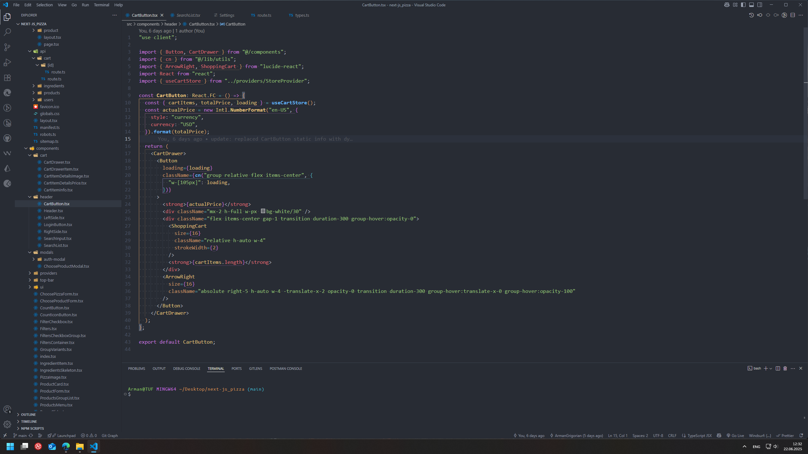

# 🌿 Code Nature — A Calm VS Code Theme Inspired by Nature

> A peaceful, nature-inspired Visual Studio Code theme that helps you focus and feel good while coding.

---

At first glance, it may seem that themes are just about colors — but every programmer knows how important the right color palette is. **Properly selected colors can enhance comfort, reduce eye strain, and make hours of coding more enjoyable.**

**Code Nature** blends soft, earthy tones with clean syntax highlighting to give you a workspace that feels fresh, balanced, and easy on the eyes.

---

## 🌈 Theme Preview

> *A gentle blend of greens, browns, and neutral shades for calm, focused development.*

---

## ✨ Features

- 🌿 Soothing, nature-inspired color palette
- 📚 Syntax highlighting for JavaScript, TypeScript, Python, HTML, CSS, JSON, Markdown, and more
- 💡 Optimized for readability in dark mode
- 🔧 Works beautifully with popular extensions like GitLens, ESLint, Prettier, and Live Server
- 🧪 Great for day-to-day development, writing, and debugging

---

## 📦 Installation

### From the Visual Studio Code Marketplace

1. Open **Extensions** in VS Code
2. Search for **Code Nature**
3. Click **Install**
